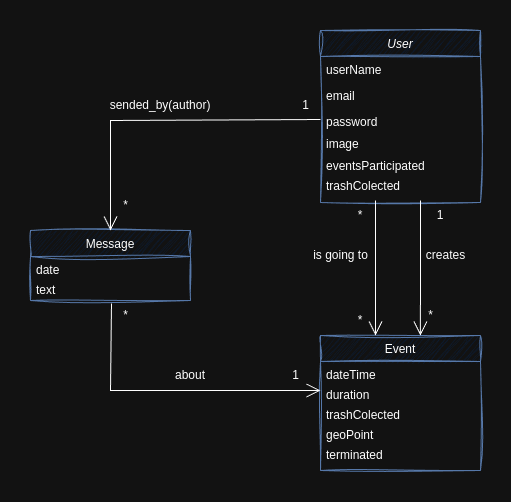
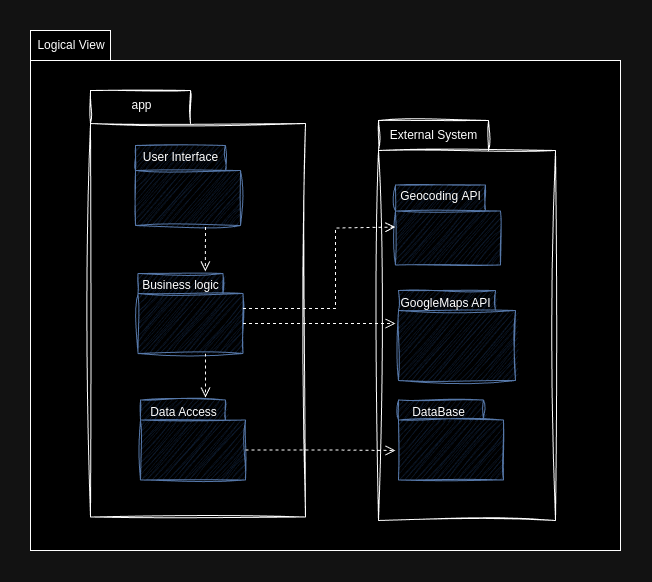
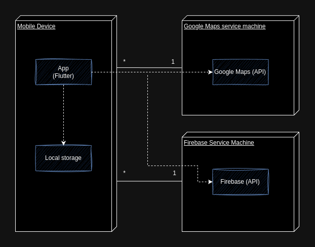
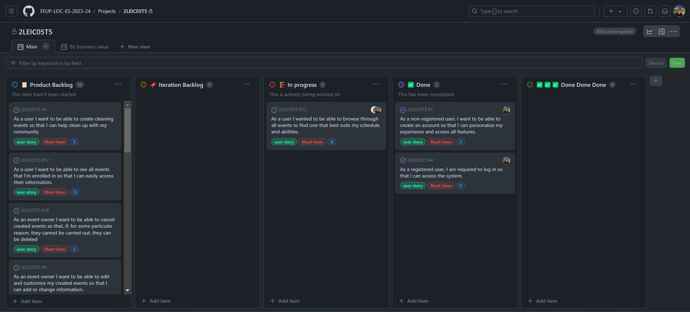
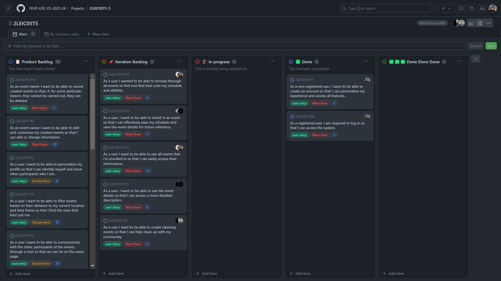
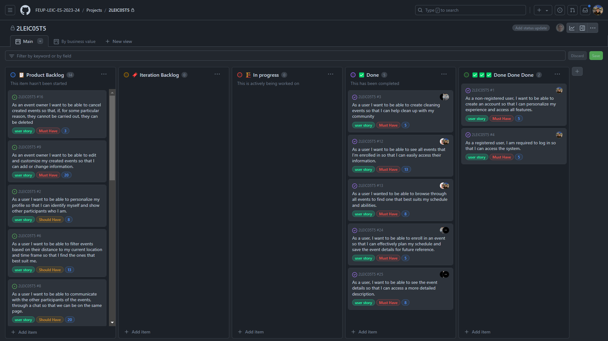
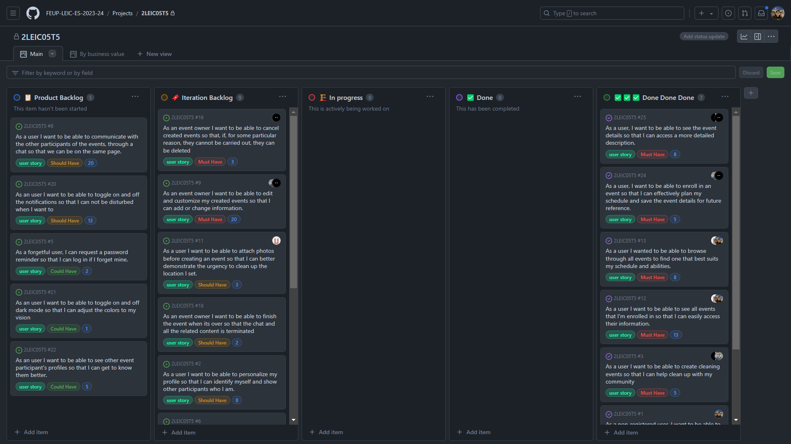
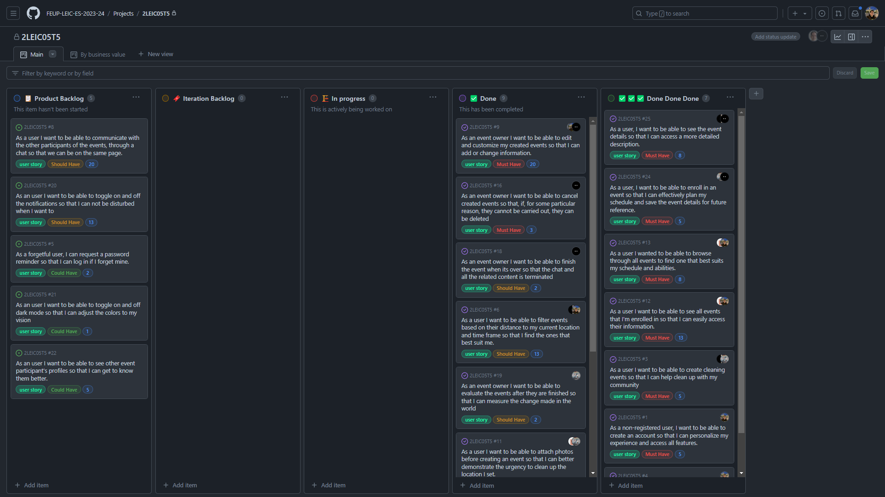
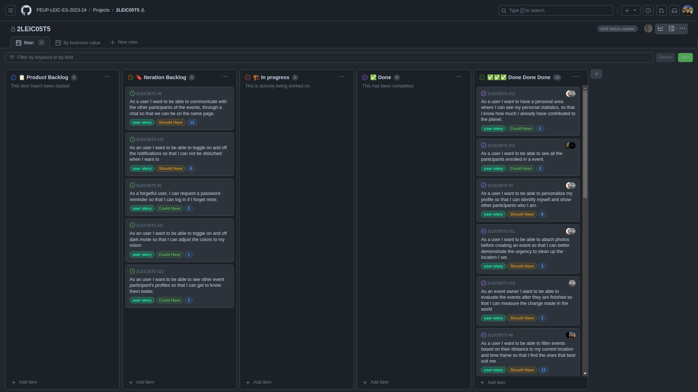
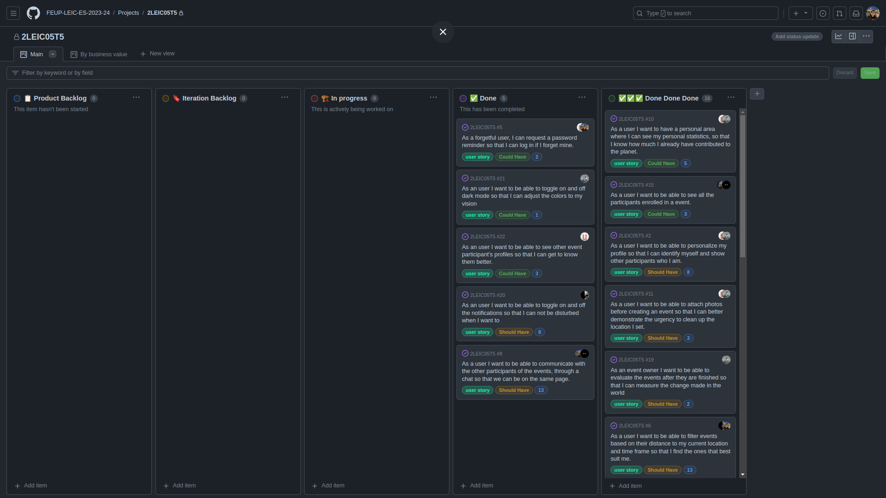

<!-- Template file for README.md for LEIC-ES-2023-24 -->

<!-- > [!NOTE] In this file you can find the structure to use to document your app as a product in the README.md file. Along the file you will find guidelines that you can delete or comment-->

# CleanCity Development Report

Welcome to the documentation pages of the CleanCity!

You can find here details about the Clean City, from a high-level vision to low-level implementation decisions, a kind of Software Development Report, organized by type of activities: 

* [Business modeling](#Business-Modelling) 
  * [Product Vision](#Product-Vision)
  * [Features and Assumptions](#Features-and-Assumptions)
  * [Elevator Pitch](#Elevator-pitch)
* [Requirements](#Requirements)
  * [Domain model](#Domain-model)
* [Architecture and Design](#Architecture-And-Design)
  * [Logical architecture](#Logical-Architecture)
  * [Physical architecture](#Physical-Architecture)
  * [Vertical prototype](#Vertical-Prototype)
* [Project management](#Project-Management)
  * [Definitions](#Definitions)
  * [Sprint Retrospective](#sprint-retrospective)

Contributions are expected to be made exclusively by the initial team, but we may open them to the community, after the course, in all areas and topics: requirements, technologies, development, experimentation, testing, etc.

Please contact us!

Thank you!

Eduardo Ferreira up202206628@edu.fe.up.pt  
Mansur Mustafin up202102355@edu.fe.up.pt   
Pedro Marinho up202206854@edu.fe.up.pt  
Sergio Nossa up202206856@edu.fe.up.pt  
Xavier Martins up202206632@edu.fe.up.pt  

---
## Business Modelling

### Product Vision

<!-- Start by defining a clear and concise vision for your app, to help members of the team, contributors, and users into focusing their often disparate views into a concise, visual, and short textual form. It provides a "high concept" of the product for marketers, developers, and managers.

A product vision describes the essential of the product and sets the direction to where a product is headed, and what the product will deliver in the future. 

**We favor a catchy and concise statement, ideally one sentence.**

We suggest you use the product vision template described in the following link:
* [How To Create A Convincing Product Vision To Guide Your Team, by uxstudioteam.com](https://uxstudioteam.com/ux-blog/product-vision/)

To learn more about how to write a good product vision, please see also:
* [Product Management: Product Vision, by ProductPlan](https://www.productplan.com/glossary/product-vision/)
* [Vision, by scrumbook.org](http://scrumbook.org/value-stream/vision.html)
* [How to write a vision, by dummies.com](https://www.dummies.com/business/marketing/branding/how-to-write-vision-and-mission-statements-for-your-brand/)
* [20 Inspiring Vision Statement Examples (2019 Updated), by lifehack.org](https://www.lifehack.org/articles/work/20-sample-vision-statement-for-the-new-startup.html)-->

**Empowering communities to organize trash cleaning events, bringing people together to create a meaningful impact, seamlessly and intuitively.**

### Features and Assumptions

<!-- Indicate an  initial/tentative list of high-level features - high-level capabilities or desired services of the system that are necessary to deliver benefits to the users.
 - Feature XPTO - a few words to briefly describe the feature
 - Feature ABCD - ...
...

Optionally, indicate an initial/tentative list of assumptions that you are doing about the app and dependencies of the app to other systems. -->

#### High-Level Features
* **Event:** Users can create and view events. Event include details like title, description, location, time, and managing participants.
* **User Authentication:** Allows users to securely log in and register within the app. Includes password recovery and user verification functionalities.
* **Location Integration:** Integration with Google Maps for displaying event locations, navigating to events, and searching for events based on geographical locations.
* **In-App Messaging:** A messaging feature that allows users to communicate with each other within the app.
* **User Impact Statistics:** This feature enables users to track and view their personal contribution to waste collection efforts.

#### Assumptions of dependencies
* The app relies on [Firebase](https://firebase.google.com/) for backend services including database, authentication, and notifications.
* Internet Connectivity. App assumes internet connectivity.
* [Geocoding](https://pub.dev/packages/geocoding). This functionality allowing users to input location names.
* [Google Maps API](https://pub.dev/packages/google_maps_flutter). 

### Elevator pitch
Ever wanted to make a positive impact on your community by cleaning up local areas but didn't know where to start?

Imagine an app that empowers you to organize community cleanups effortlessly, bringing people together for a common cause.

Introducing CleanCity, an innovative app that lets you create and join local cleanup events. Simply choose a location, set a time, and invite others to join you in making your community cleaner and greener.

CleanCity is perfect for environmentally conscious individuals who want to take action against litter and pollution. Whether you’re an individual looking to make a difference or a group aiming to mobilize volunteers, our app is your go-to tool.

Our app, CleanCity, stands out with  an integrated chat system that makes it easy to communicate and plan with other participants in real-time .Additionally, you can view event locations via Google Maps, and to ensure you never miss an event, our app sends notifications for upcoming cleanups.

## Requirements

<!--
In this section, you should describe all kinds of requirements for your module: functional and non-functional requirements.

### User stories
> [!Caution] This section will *not* exist in your report, it is here only to explain how you should describe the requirements of the product as **user stories**.

The user stories should be created as GitHub items in the Project board. 

A user story is a description of desired functionality told from the perspective of the user or customer. A starting template for the description of a user story is *As a < user role >, I want < goal > so that < reason >.*

User stories should be created and described as items in your GitHub Project with the label "user story".

You should name the item with either the full text of the user story or a shorter name, up to you, and, in the "comments" field, add all relevant notes, the image(s) of the user interface mockup(s) (see below) and the acceptance test scenarios (see below), linking to its acceptance test in Gherkin, whenever available.

**INVEST in good user stories**. 
You may add more details after, but the shorter and complete, the better. In order to decide if the user story is good, please follow the [INVEST guidelines](https://xp123.com/articles/invest-in-good-stories-and-smart-tasks/).

**User interface mockups**.
After the user story text, you should add a draft of the corresponding user interfaces, a simple mockup or draft, if applicable.

**Acceptance tests**.
For each user story you should write also the acceptance tests (textually in [Gherkin](https://cucumber.io/docs/gherkin/reference/)), i.e., a description of scenarios (situations) that will help to confirm that the system satisfies the requirements addressed by the user story.

**Value and effort**.
At the end, it is good to add a rough indication of the value of the user story to the customers (e.g. [MoSCoW](https://en.wikipedia.org/wiki/MoSCoW_method) method) and the team should add an estimation of the effort to implement it, for example, using points in a kind-of-a Fibonnacci scale (1,2,3,5,8,13,20,40, no idea). -->

### Domain model

<!-- To better understand the context of the software system, it is very useful to have a simple UML class diagram with all the key concepts (names, attributes) and relationships involved of the problem domain addressed by your module. 
Also provide a short textual description of each concept (domain class). -->

Our app allows *Users* to create personal accounts, enabling them to discover and participate in *Events* located in various cities. It features an integrated chat system for seamless communication among participants.
* **User** - store information about user with his statistics.
* **Event** - store information about event, with geoPoint that contains latitude and longitude.
* **Message** - text and datetime of message that was sent by User to the respective Event chat.

  

## Architecture and Design
<!-- The architecture of a software system encompasses the set of key decisions about its overall organization. 

A well written architecture document is brief but reduces the amount of time it takes new programmers to a project to understand the code to feel able to make modifications and enhancements.

To document the architecture requires describing the decomposition of the system in their parts (high-level components) and the key behaviors and collaborations between them. 

In this section you should start by briefly describing the overall components of the project and their interrelations. You should also describe how you solved typical problems you may have encountered, pointing to well-known architectural and design patterns, if applicable.
-->
### Logical architecture
<!-- The purpose of this subsection is to document the high-level logical structure of the code (Logical View), using a UML diagram with logical packages, without the worry of allocating to components, processes or machines.

It can be beneficial to present the system in a horizontal decomposition, defining layers and implementation concepts, such as the user interface, business logic and concepts.

Example of _UML package diagram_ showing a _logical view_ of the Eletronic Ticketing System (to be accompanied by a short description of each package):
-->

User interacts though the *User Interface* for visual elements and interactions, the *Business Logic* layer handling core functionalities; and external systems integrations, including *Geocoding* and *Google Maps* APIs. Data storage and retrieval are handled by the *DataBase* (*Firebase*).

  

### Physical architecture
<!-- The goal of this subsection is to document the high-level physical structure of the software system (machines, connections, software components installed, and their dependencies) using UML deployment diagrams (Deployment View) or component diagrams (Implementation View), separate or integrated, showing the physical structure of the system.

It should describe also the technologies considered and justify the selections made. Examples of technologies relevant for ESOF are, for example, frameworks for mobile applications (such as Flutter).

Example of _UML deployment diagram_ showing a _deployment view_ of the Eletronic Ticketing System (please notice that, instead of software components, one should represent their physical/executable manifestations for deployment, called artifacts in UML; the diagram should be accompanied by a short description of each node and artifact):

-->
Each user interacts with the application via their device, which in turn accesses external machines to retrieve necessary data, as GoogleMaps and Firebase.

  

### Vertical prototype

In Iteration 0, we have successfully implemented some features for our application. Key achievements include:
* **User Authentication:** Developed login and registration functionalities utilizing Firebase Authentication. With error handling.
* **Event Listing on Main Page:** Created a main page that dynamically lists events, fetching data in real-time from Firestore.

Some screenshots and demos:
<!--TODO por as images-->
<pre>
                    1. Initial screen            2. Login                   3. Register
</pre>

 &nbsp;&nbsp;&nbsp;&nbsp;
 &nbsp;&nbsp;&nbsp;&nbsp;
 &nbsp;&nbsp;&nbsp;&nbsp;

 
<pre>
                                 4. Main Page                 5. Demo
</pre>

 &nbsp;&nbsp;&nbsp;&nbsp;
 &nbsp;&nbsp;&nbsp;&nbsp;

**Note on Current Functionality:** Please be aware that in this iteration, some of the buttons and interactive elements within the app are not fully operational. These elements are part of our planned features and will be developed and integrated in subsequent iterations.  

<!-- To help on validating all the architectural, design and technological decisions made, we usually implement a vertical prototype, a thin vertical slice of the system integrating as much technologies we can.

In this subsection please describe which feature, or part of it, you have implemented, and how, together with a snapshot of the user interface, if applicable.

At this phase, instead of a complete user story, you can simply implement a small part of a feature that demonstrates thay you can use the technology, for example, show a screen with the app credits (name and authors).
-->

## Project management
<!-- Software project management is the art and science of planning and leading software projects, in which software projects are planned, implemented, monitored and controlled.

In the context of ESOF, we recommend each team to adopt a set of project management practices and tools capable of registering tasks, assigning tasks to team members, adding estimations to tasks, monitor tasks progress, and therefore being able to track their projects.

Common practices of managing iterative software development are: backlog management, release management, estimation, iteration planning, iteration development, acceptance tests, and retrospectives.

You can find below information and references related with the project management in our team: 

* Backlog management: Product backlog and Sprint backlog in a [Github Projects board](https://github.com/orgs/FEUP-LEIC-ES-2023-24/projects/5);
* Release management: [v0](#), v1, v2, v3, ...;
* Sprint planning and retrospectives: 
  * plans: screenshots of Github Projects board at begin and end of each iteration;
  * retrospectives: meeting notes in a document in the repository;
-->
### Definitions:
* **Ready**
  - User story includes a simple mockup.
  - User story has been estimated by the development team.
  - User story provides Acceptance Tests. (Clear scenarios under which the feature is considered working)
  - User story is in the '🔖 Iteration Backlog' on the project board.
* **Done**
  - Pull request has been reviewed and approved.
  - Acceptance Tests and Unit tests have passed.
  - Works on a real mobile phone.

### Sprint Retrospective
* [Iteration 0](#Iteration-0)
* [Iteration 1](#Iteration-1)
* [Iteration 2](#Iteration-2)
* [Iteration 3](#Iteration-3)

#### Iteration 0

Happiness Meter:

  

Retrospective
* **Did well:**
    - Effective Team Meetings: Our team collaboratively engaged in productive meetings, facilitating clear communication and efficient decision-making.
    - Clear Definition of the App: We successfully defined the app's core functionalities and features, ensuring a shared understanding and a focused approach to development.
* **Do differently:**
    - Implementing Parallel Task Management: For upcoming iterations, we plan to distribute tasks among smaller groups.
* **Puzzles:**
    - Understanding and Implementing Google Maps API: Currently, we face uncertainty in how to properly implement and utilize the Google Maps API.

<pre>
                                 Board at the End of Iteration 0
</pre>

  

#### Iteration 1

Happiness Meter:

  

Retrospective
* **Did well:**
    - **Successful Parallel Task Implementation**: Our team adeptly handled three tasks simultaneously, enhancing our productivity and ensuring progress on multiple fronts.
* **Do differently:**
    - ...
* **Puzzles:**
    - **Optimization of Storage in Firebase**: We need to develop strategies to optimize our storage usage in Firebase, particularly for images and other data, to avoid exceeding our storage limits.

<pre>
                                 Board at the Start of Iteration 1
</pre>

  

<pre>
                                 Board at the End of Iteration 1
</pre>

  

#### Iteration 2

Happiness Meter:

  

Sprint Review: 
* Add owner tag for event card
* Add filter for my events
* Change title for different pages

Retrospective
* **Did well:**
    - High development speed.
* **Do differently:**
    - Merge diferent branches as soon as possible, to not delay conflict management and to avoid repeated code conflicts.
* **Puzzles:**
    - Make crop image work on real smartphone.
<pre>
                                 Board at the Start of Iteration 2
</pre>

  

<pre>
                                 Board at the End of Iteration 2
</pre>

  

#### Iteration 3

Happiness Meter:

   

Sprint Review: 
* ...

Retrospective
* **Did well:**
    - Good Time Management.
* **Do differently:**
    - Schedule more frequent meetings to enhance communication and coordination.
* **Puzzles:**
    - Acceptance Tests: Some widgets are incompatible with older versions of Dart, requiring code adjustments to ensure proper testing.
<pre>
                                 Board at the Start of Iteration 3
</pre>

  

<pre>
                                 Board at the End of Iteration 3
</pre>

  
 ...

